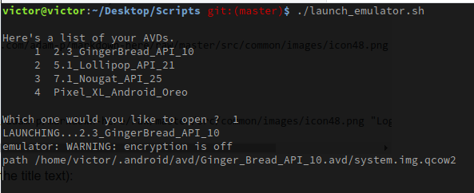

# scripts

## 1. launch_emulator.sh
I use this script to launch any emulator I want, straight from the command line.

Here is how it works:

**NOTE:** *If you need to use this, you might need to edit the location of your Android SDK*

Happy Emulator Launching !!  😀😀

